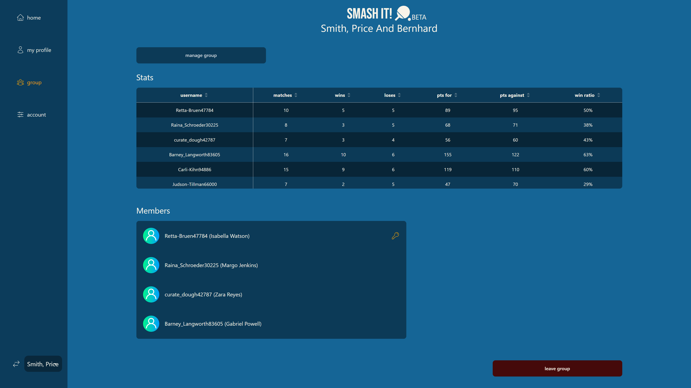

  <h1>Smash It!</h1>
  
  

    Performance tracking for table tennis.
  

<h4>
    <a href="https://smash-it-table-tennis.com">View Project</a>

 

<!-- About the Project -->

## Motivation

The idea for Smash It! came about whilst I was enrolled in my web development bootcamp. My coursemates and I would play table tennis every chance we got. The problem was, we struggled to keep track of our performances (wins, loses, matches etc.). We tried using a whiteboard and a spreadsheet but these proved impractical or cumbersome. For my capstone project, I thought it would be a good idea to build an app that would solve this problem.

The previous version of the app was more of a proof of concept. I decided to build a production ready version that real users could use. To potentially solve a problem many other table tennis groups may find.

<!-- TechStack -->

## Tech Stack (Current)

### Client/Server

- [Next.js](https://nextjs.org)
- [NextAuth.js](https://next-auth.js.org)
- [TypeScript](https://www.typescriptlang.org)
- [Obscentiy](https://github.com/jo3-l/obscenity#readme)
- [Resend](https://resend.com/home)

### Client

- [Tailwind CSS](https://tailwindcss.com)
- [DaisyUI](https://daisyui.com)
- [Zustand](https://zustand-demo.pmnd.rs)

### Server

- [Prisma ORM](https://www.prisma.io/orm)

### Database

- [PostgreSQL](https://www.postgresql.org)

### Dev

- [Vitest](https://vitest.dev)
- [Snaplet Seed](https://www.snaplet.dev)

## Approach

The current approach for this project was to use Next.js, a React framework for building full-stack web applications. Therefore having the benefit of building a single page application integrated server side rendering. To speed up the development process to achieve a minimum viable product, I decided to use Tailwind CSS for utility css classes and daisyUI a TailwindCSS component library. NextAuth.js was used for user authentication and session management. Zustand was used for state management on the client side. Obscenity was used to prevent the use of profanity in the app. Resend is an email service, used for email verification and password resets.

Primsa ORM was used to generate the database schema and interact with the database on the application level. A PostgreSQL database was used. Snaplet seed was used for database seeding during testing.

## Deployment

Smash It! was deployed on [Vercel](https://vercel.com). The database was deployed on [Render](https://render.com).

## Enhancements

This app is currently an MVP. A lot more features can be added. Feedback and feature requests welcome.
